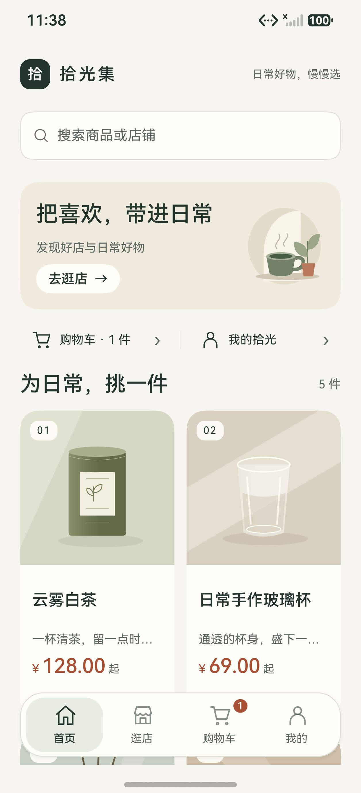
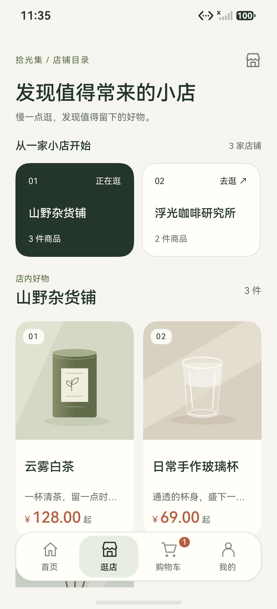
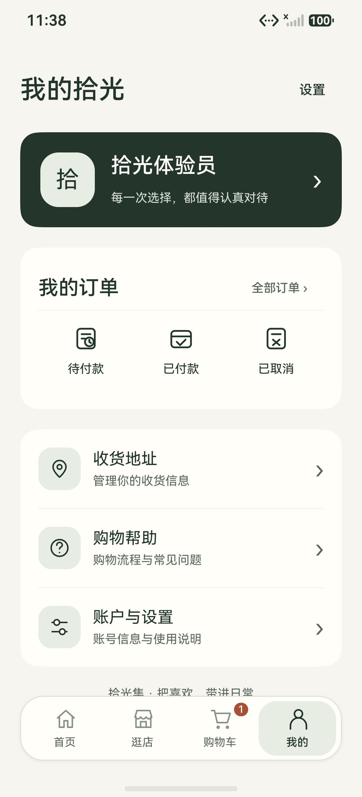
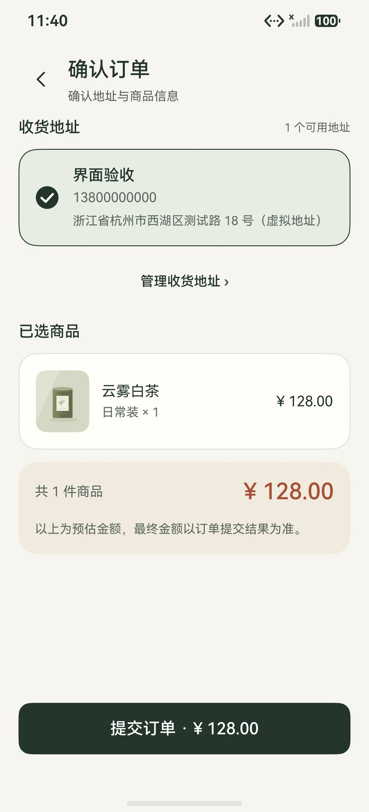
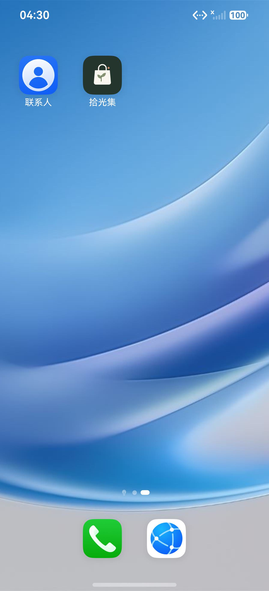
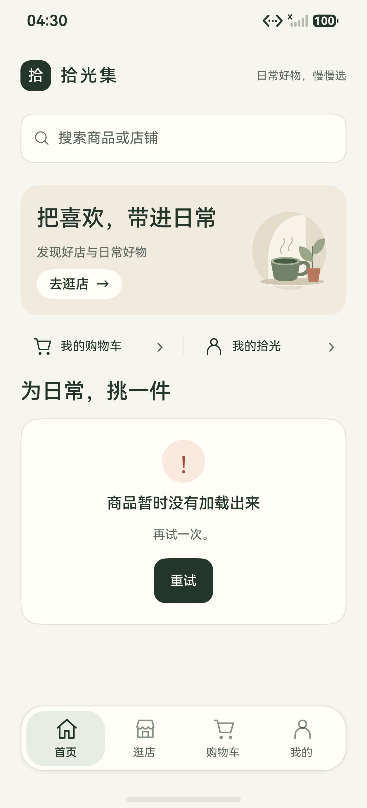

# 拾光集消费者端视觉验收（2026-09-22）

## 本轮目标

在不改变既有商城方向和已可用交互的前提下，提升整体完成度、品牌一致性、信息层级和日常可用性。视觉方向为暖白纸感背景、深绿主色、陶土色金额与低饱和商品插画。

## 实际模拟器画面

以下画面来自 Pura 90 Pro 模拟器，数据由 `scripts/consumer-ui-fixture.cjs --visual` 提供。该 fixture 只存在于本机内存，不连接真实后端、不写数据库，也不代表真实商品或真实订单。

### 首页



### 店铺目录



### 个人中心



### 确认订单



### 桌面品牌图标



### 正式接口不可达状态



恢复正式接口配置并重新安装 HAP 后，当前联调服务不可达时，首页仍保留品牌结构，并给出明确的错误说明和重试按钮；未把 fixture 数据带入正式构建。

## 覆盖范围

- 默认字号：桌面图标和名称、首页、店铺、空店、商品详情、规格弹层、登录、地址列表/编辑、购物车、确认订单、订单列表/详情、个人中心、帮助与设置。
- 1.3 倍字号：首页标题与两列商品卡、个人中心、订单筛选与卡片、地址列表和编辑表单、规格弹层、登录及安全键盘、购物车、确认订单。
- 关键流程：未登录从规格弹层加购会先关闭弹层再进入登录；登录后返回商品详情，可继续加购并进入购物车和确认订单。
- 可读性：共享主题 33 组文字/底色对比度均不低于 4.5:1；新增 SVG 均可被 XML 解析。

## 自动验证

```powershell
node scripts/check-theme.cjs
node scripts/check-shopping.cjs <TypeScript模块目录>
node scripts/check-consumer.cjs <TypeScript模块目录>
hvigorw --mode module -p product=default -p module=entry@default assembleHap --no-daemon
```

本轮三组检查均通过，SDK 26.0.0 构建成功。项目没有个人签名配置，因此产物仍为 `entry-default-unsigned.hap`。

## 已知边界

- 最终代码保持 Remote 数据源，接口地址为 `http://10.251.73.246:8080`；本次没有声称真实后端已重新联通。
- 商品图片仍为本地示意插画，未知商品使用中性占位图；订单详情不会把未知商品错误映射成茶叶图。
- 当前品牌是固定浅色视觉，系统控件与系统栏会保持浅色关系；尚未提供完整深色主题。
- 尚未完成实体真机、屏幕阅读器、小屏和折叠屏专项验收。在线支付、物流与退款仍保持未开放提示。
